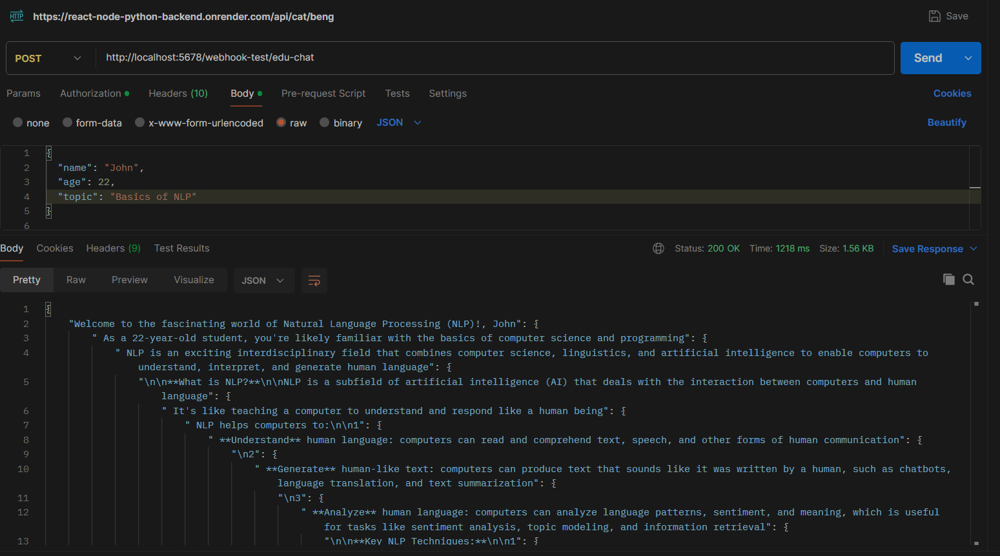
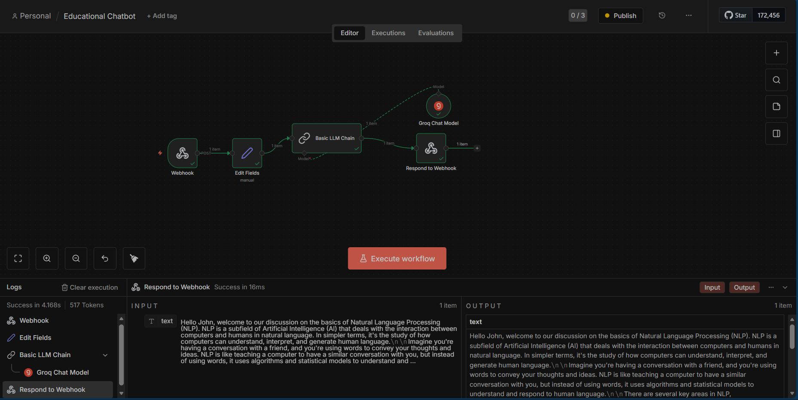

# Educational Chatbot – Webhook + LLM Workflow

This project demonstrates an **Educational Chatbot** built using a webhook-based API and an LLM workflow.  
It takes user input (like name, age, and topic), processes it through a language model, and returns an educational response.

---

## 🔹 Overview

- User sends a request with basic details and a learning topic.
- The backend webhook receives the request.
- A Large Language Model (LLM) generates an educational response.
- The response is sent back in JSON format.

---

## 🖼️ Image 1: API Request & Response (Postman)

**What this shows:**
- A `POST` request sent to the webhook endpoint.
- JSON input includes `name`, `age`, and `topic`.
- The API returns a structured educational explanation.
- Status `200 OK` confirms successful execution.

---

## 🖼️ Image 2: LLM Workflow Editor (n8n)

**What this shows:**
- A visual workflow created in **n8n**:
  - Webhook (input)
  - Edit Fields (data preparation)
  - Basic LLM Chain (prompt handling)
  - Groq Chat Model (AI response)
  - Respond to Webhook (output)
- Execution logs showing successful runs and token usage.

---

## 🖼️ Image 3: User Interface

---
## 🛠️ Built With

- **n8n** – Open-source workflow automation tool used to design and run the chatbot logic  
  🔗 https://github.com/n8n-io/n8n  

- **Postman** – API testing tool used to send requests and verify responses  
  🔗 https://www.postman.com/  

- **Groq LLM** – Used for fast and efficient AI-generated responses

---

## ✅ Key Features

- Webhook-based API communication
- Visual, no-code/low-code workflow
- LLM-powered educational explanations
- JSON-based input and output

---

## 🚀 Use Case

Ideal for:
- Educational chatbots
- AI tutoring platforms
- Learning assistants powered by LLMs

---

## 📌 Notes

- The workflow can be extended with memory, user authentication, or topic tracking.

---

**Happy Building! 🎓🤖**
